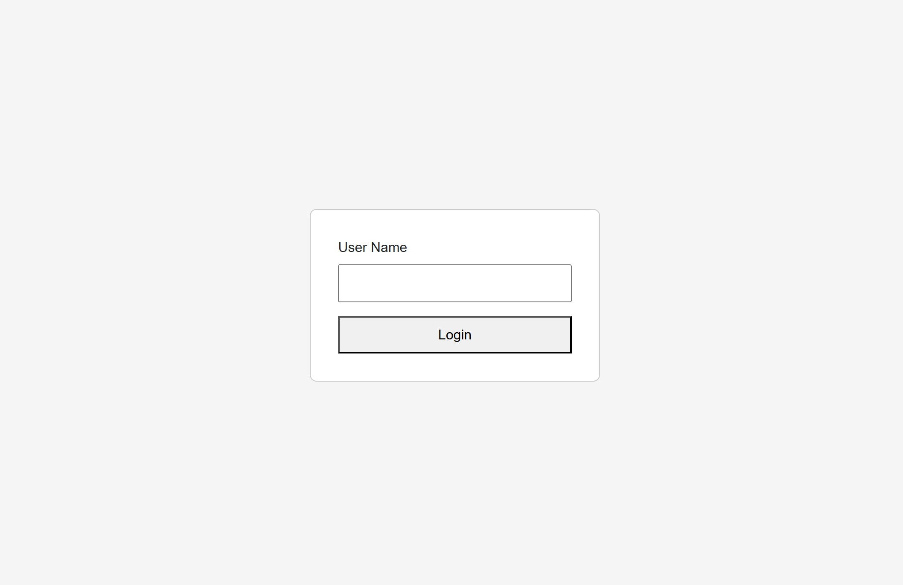
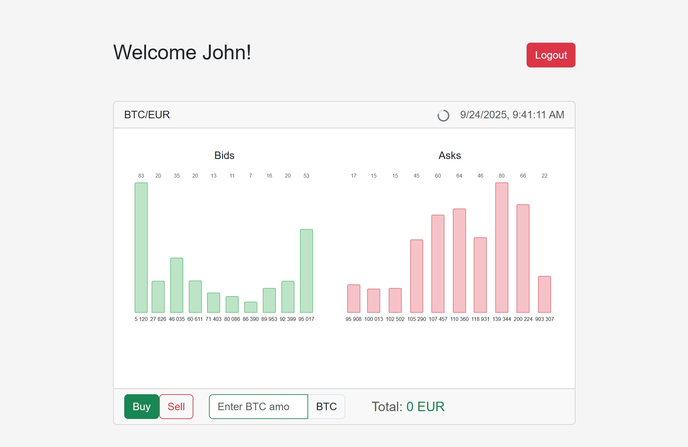
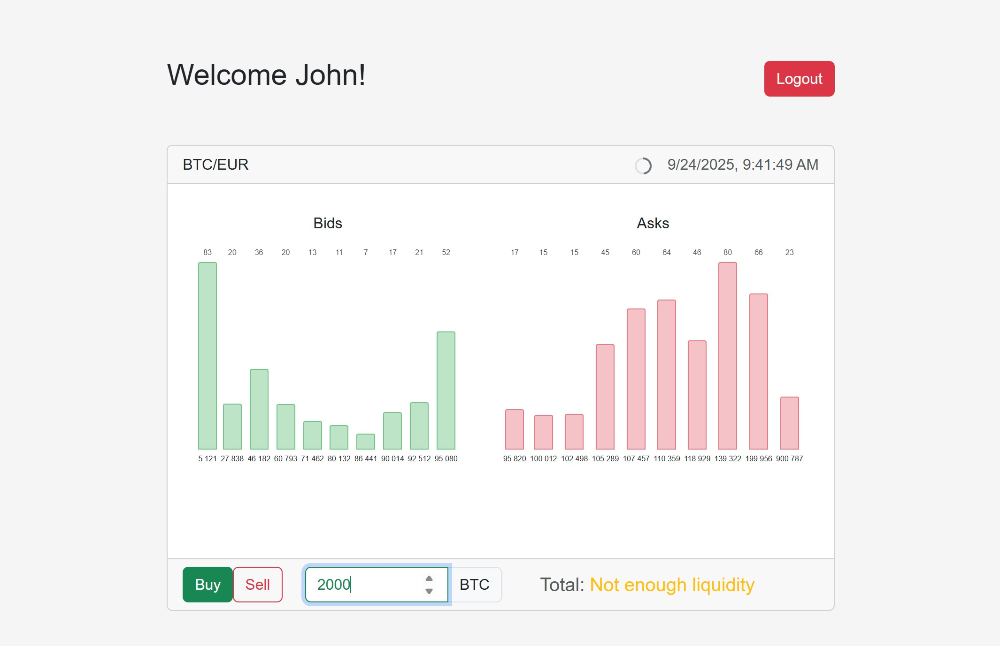

# BitStore

**A real-time cryptocurrency order book viewer with the current price calculator. Built with ASP.NET Core and Vue.js.**

## Architecture

### Backend (.NET 9)
- **BitStore.Server**: ASP.NET Core Web API with JWT authentication
- **BitStore.Core**: Core business logic and services
- **BitStore.Data**: EF Core data access layer
- **BitStore.Bitstamp**: Bitstamp API integration service
- **BitStore.Core.Tests**: Unit tests
- **BitStore.Client**: Vue.js client application

Key features:
- Background polling service for real-time order book updates
- JWT-based multi-user authentication
- Snapshots of data requested by users

### Frontend (Vue.js)
- Vue 3 with TypeScript
- Bootstrap for styling
- Real-time order book visualization and live price calculation

## Prerequisites

- .NET 9 SDK
- SQL Server
- Node.js 18+
- Visual Studio 2022+ or VS Code

## Quick Start

### Backend

1. Open solution in Visual Studio
2. From the solution folder restore Nuget packages:
```bash
dotnet restore
```
3. Update connection string in `BitStore.Server/appsettings.json` if needed:
```json
"ConnectionStrings": {
    "DefaultConnection": "Server=.\\SQLEXPRESS;Database=BitStore;Trusted_Connection=True;MultipleActiveResultSets=true;TrustServerCertificate=true"
}
```

3.1. Production Database Setup

(Please make sure EF CLI had been setup earlier, or do this as follows)
```bash
dotnet tool install --global dotnet-ef
```

 Use EF Core command (if direct database access is available):
```bash
dotnet ef database update --project BitStore.Data --startup-project BitStore.Server
```

4. Run the application:
```bash
cd BitStore.Server
dotnet run
```
The API will be available at `https://localhost:7085` by default

### Frontend

1. Install dependencies:
```bash
cd BitStore.Client
npm install
```

2. Run development server:
```bash
npm run dev
```
The app will be available at `http://localhost:52134` by default


## Architecture Details

### Authentication Flow
1. User logs in with username (simplified auth for demo)
2. Server generates JWT token
3. Token is used for subsequent API calls

### Data Flow
1. Background service polls Bitstamp API
2. Order book data is cached in memory
3. Users request latest data through API
4. User requests snapshots are logged to database
5. Frontend visualizes the data and displays calculations
6. User is able to logout

## Development Notes

- Set logging level to "Trace" for detailed HTTP logging
- Unit tests available for core services
- Database migrations are automatically applied in development and should be applied manually in production using one of the methods described above

**Please also take a look at the [code conventions](./CODE_STYLE.md) used in the project. **



